# Elysium Agent — Architettura dell'Harness

> Documento tecnico dell'**harness multi-agente**: una chat per progetto che, per goal complessi,
> attiva un loop di agenti LLM coordinati (decompose → scatter → quality gate → retry) dentro un
> workspace isolato, producendo codice reale e un report misurabile.

## Flusso principale

```mermaid
flowchart TD
    U["🧑‍💻 Utente"] -->|"POST /api/projects/{id}/chat&#10;body: {message: goal}"| API["FastAPI · api/routes.py&#10;SSE streaming (text/event-stream)"]
    API --> CA["ChatAgent · harness/chat.py"]
    CA -->|"respond_stream + wants_loop"| DECIDE["decide() · engine/state.py&#10;4-Band Filter + detect_tier"]


    %% ── TIER 1: risposta diretta ───────────────────────────
    DECIDE -->|"tier 1 · task atomico"| DIR["Risposta diretta&#10;llm.stream(...) chunk by chunk"]
    DIR -->|"SSE: chunk → done (kind: chat)"| API
    DIR --> SAVE1["chat.json · harness/projects.py&#10;append_message(assistant, full)"]

    %% ── TIER 2+: loop multi-agente ─────────────────────────
    DECIDE -->|"tier 2-4 · feature/refactor/sistema"| SYS["SSE: {type: loop, goal, tier}"]
    SYS --> ORC["Orchestrator · harness/orchestrator.py&#10;HarnessRun.run()"]

    ORC --> DECOMP["decompose via LLM · engine/decompose.py&#10;task atomici indipendenti (JSON)"]
    DECOMP --> VAL{"Validazione deterministica&#10;engine/decompose.py (Phase 2e)"}
    VAL -->|"JSON invalido / over-slot"| DECOMP
    VAL -->|"⚠ conflitto file tra task"| DECOMP
    VAL -->|"✅ file disgiunti · slots ok"| SCATTER["Scatter parallelo · engine/scatter.py&#10;asyncio.gather + semaforo max_concurrent=8"]

    SCATTER --> W1["Worker 1 · LLM"]
    SCATTER --> W2["Worker 2 · LLM"]
    SCATTER --> WN["Worker N · LLM"]

    W1 --> QG1["Quality Gate per-task&#10;engine/result_parser + quality_gate"]
    W2 --> QG1
    WN --> QG1

    QG1 --> SEC["security_shield · engine/security_shield.py&#10;secrets / SQLi / API deprecate"]
    SEC -->|"issues: blocco a 0.0"| SCORE["score finale = apply_penalties&#10;stub → cap 3.0 · engine/quality_gate.py"]
    SCORE --> SUB{"score ≥ soglia 7/10?"}

    SUB -->|"❌ sotto soglia"| RETRY["retry con feedback gap&#10;(max_retries=2, 3 tentativi)"]
    RETRY --> W1
    RETRY --> W2
    RETRY --> WN

    SUB -->|"✅ sopra soglia"| WRITE["file scritti nel workspace&#10;projects/{id}/files/ · ProjectStore.write_file&#10;path traversal bloccato"]
    WRITE --> AGG["report aggregato (orchestrator)&#10;first_pass_rate · avg_quality · n_tasks · files_written"]
    AGG --> RUNS["runs/{run_id}.json · save_run"]
    AGG --> CHATFILE["chat.json · append_message&#10;meta.run_report (formattato per l'utente)"]
    RUNS -->|"GET /api/projects/{id}/runs"| API
    CHATFILE -->|"SSE: {type: report} → done (kind: loop)"| API
```

## Componenti

| Modulo | Ruolo |
|---|---|
| `engine/state.py` | `decide()`: 4-Band Filter (keyword per banda 1-4) + `detect_tier()`; stato `State` (goal, tier, threshold, first_pass_rate, avg_quality). |
| `engine/decompose.py` | Decomposizione via LLM (mai hardcoded) + validazione deterministica: JSON valido, **nessun conflitto di file tra task**, `count ≤ available_slots`. |
| `engine/scatter.py` | Dispatch parallelo asincrono (`asyncio.gather` + semaforo `max_concurrent`). |
| `engine/quality_gate.py` | Penalità deterministiche sul **self-score** del modello: security issue → blocco secco `0.0`; stub/TODO → cap `3.0`. |
| `engine/result_parser.py` | UNICO punto di parsing del formato `## RESULT` (task_id, status, quality_score, gaps, files) — DRY. |
| `engine/security_shield.py` | Scan regex deterministico del codice prodotto: hardcoded secrets (CRITICAL), SQL injection (HIGH), API deprecate (HIGH), placeholder secret (WARNING). |
| `engine/budget.py` | Cap token/round, stima pre-flight; **mai prezzi in dollari inventati**, solo token. |
| `engine/gauntlet.py` | Loop legacy builder/critic (nucleo Elysium v0.15, checkout per-round non bloccante) — non sul percorso principale dell'harness chat. |
| `harness/chat.py` | `ChatAgent`: conversazione per progetto, `decide()` → risposta diretta stream o attivazione loop. |
| `harness/orchestrator.py` | Cuore del loop: `HarnessRun.run()` — decompose → scatter → quality gate → retry → report salvato in `runs/`. |
| `harness/projects.py` | `ProjectStore`: workspace persistenti su disco (`files/`, `chat.json`, `runs/`), path traversal bloccato. |
| `llm/client.py` | Client OpenAI-compatible async (`complete`/`stream`), retry/backoff, `QuotaExhaustedError` al primo colpo (quota rolling 5h — mai retry cieco). |
| `api/routes.py` | REST + SSE (`/api/projects/...`, chat streaming `type: loop|report|chunk|error|done`). |
| `api/client_factory.py` | Costruzione `LLMClient` da `config.yaml` (provider opencode-go, `deepseek-v4-flash`) + key da env. |
| `web/` | SPA Alpine.js (`app.js`, `index.html`, dark futurist, italiano) — polling progetti, SSE, report card. |

## Data flow del report

1. `orchestrator.run()` aggrega il report (`first_pass_rate`, `avg_quality`, `n_tasks`, `n_passed`, `files_written`, `tokens_estimate`, `duration_s`, stato per task).
2. `store.save_run(project, report)` → **`projects/{id}/runs/{run_id}.json`** (storico, esposto da `GET /runs`).
3. `chat.py` formatta il report (`_format_report`) e lo salva in **`projects/{id}/chat.json`** con `meta.run_report` per il messaggio assistant.
4. Nei turni successivi `build_messages()` comprime il report precedente in una nota di contesto (`[stato loop precedente] status=… first_pass=…`), escludendolo dalla storia grezza.
5. La UI riceve gli eventi SSE: `loop` → pill di stato, poi `report` (report card) e `done`.

## Vincoli architetturali

- **File esclusivi per worker** — la decomposizione assegna file *disgiunti* a ogni task (validazione `conflitto file … tra {task A} e {task B}`); il worker riceve `File tuoi (esclusivi, non toccare altri)` e **non riscrive file altrui**.
- **Soglia di qualità 7/10** — `DEFAULT_THRESHOLD = 7.0`; il retry scatta solo sotto soglia, con feedback dei gap del tentativo precedente, max 2 retry (3 tentativi totali).
- **Mai $ inventati — solo token** — `engine/budget.py`: la stima costi usa token (`tokens_estimate = Σ attempts × 900`, stima conservativa), nessun prezzo in dollari non noto.
- **Giudizio sul self-score + penalità deterministiche** — la completeness è del modello; il codice applica solo penalità verificabili (security blocco secco, stub cap).
- **Quota: primo colpo, mai retry cieco** — `QuotaExhaustedError` (429 con segnale quota) ferma il run senza consumare i retry.
- **Zero stub/TODO accettati** — il pattern `TODO|stub|NotImplemented` nel codice di un task lo capisce a `3.0`.
- **Sandbox workspace** — le scritture sono vincolate a `projects/{id}/files/` (traversal bloccato).

## Metriche

| Metrica | Definizione |
|---|---|
| `first_pass_rate` | Task `pass` al **primo** tentativo / task tentati una volta. |
| `avg_quality` | Media dei `quality_score` finali (post-penalità) dei task. |
| `n_tasks` / `n_passed` | Task decompositi e task passati (status `completed` se tutti passano, altrimenti `partial`). |
| `tokens_estimate` | `Σ (attempts × 900)` — stima conservativa, solo token. |
| `duration_s` | Tempo di esecuzione del loop. |
| `files_written` | Elenco dei file scritti nel workspace del progetto. |
